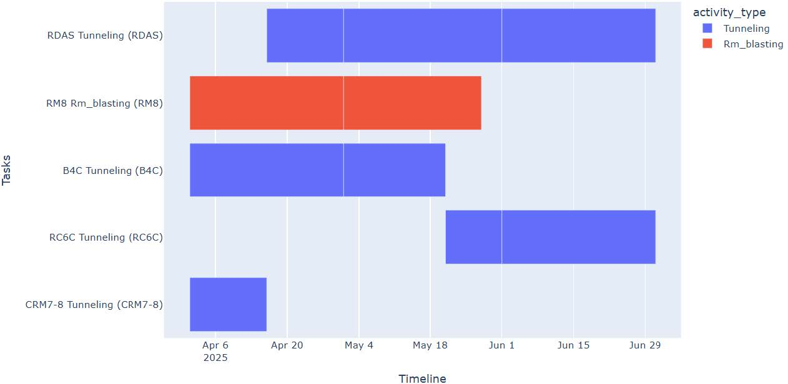

# Scheduling of Development Advancement using Constraint Programming in Underground Mining



## Project Overview
This project is an implementation of **Constraint Programming (CP)** using the **Google OR-Tools CP-SAT solver** to optimize mining activity scheduling in underground operations. The primary objective is to maximize total progress (meters) across multiple locations over a three-month period (April, May, and June 2025) while strictly adhering to operational constraints.

The project was developed as part of an undergraduate thesis focused on mining engineering and operations research.

## Key Features
- **Mathematical Optimization**: Uses CP-SAT to handle complex scheduling logic, including task start times, durations, and interval dependencies.
- **Multi-Location Scheduling**: Manages progress for five key locations:
  - Blok 4 Central (B4C)
  - Connect RM7-8 (CRM7-8)
  - RM 8 (RM8)
  - Rampdown A Selatan (RDAS)
  - RC 6 Central (RC6C)
- **Constraint Handling**:
  - **Equipment Allocation**: Manages limited Jackleg Drills and Wheel Loaders.
  - **Waste Capacity**: Limits material handling based on tons/shift and tons/month capacities.
  - **Activity Types**: Supports both **Tunneling** (shift-based) and **Blasting** (blast-based) activities.
  - **Priority System**: Prioritizes higher-value locations and earlier months in the objective function.
  - **Minimum Progress**: Ensures a minimum tunneling advancement of 38.4 meters per month.
- **Dynamic Visualization**: Generates detailed Gantt charts using Plotly to visualize the schedule and equipment assignments.

## Mathematical Formulation
The scheduling problem is formulated with:
- **Indices**: $t \in T$ (months), $v \in V$ (locations).
- **Objective Function**: Maximize $Z = \sum_{t \in T} \sum_{v \in V} \pi_v \cdot \omega_t \cdot l_{t,v}$
  - where $\pi_v$ is location priority and $\omega_t$ is month weight.
- **Constraints**:
  - Progress calculations scaled to millimeters for integer arithmetic.
  - Cumulative constraints for equipment usage sharing.
  - Logical implications for activity presence and material handling limits.

For a detailed breakdown of the mathematical relations, refer to the [Mathematical Formulation document](export_english.markdown).

## Repository Structure
- `skripsi-recode.py`: Core optimization script containing the CP model logic.
- `gantt_chart.py`: Visualization module for generating Gantt charts.
- `requirements.txt`: List of Python dependencies.
- `gantt_chart_thesis.jpg`: Example output visualization.

## Prerequisites
- **Python**: Version 3.11 is recommended.
- **Editor**: VS Code or VSCodium is suggested for development.

## Installation
1. Clone this repository to your local machine.
2. Install the required libraries:
   ```bash
   pip install -r requirements.txt
   ```

## Usage
To run the optimization and generate the schedule:
```bash
python skripsi-recode.py
```
*(Note: Use `py` or `python3` depending on your environment settings)*.

### Modifying Data
To edit the simulation parameters (locations, rates, capacities), modify the content in `skripsi-recode.py` under the `if __name__ == "__main__":` block starting around line 404.

---
**Author**: Fakhri Catur Rofi <br>
**Thesis Title**: Scheduling of Development Advancement using Constraint Programming in Underground Mining
